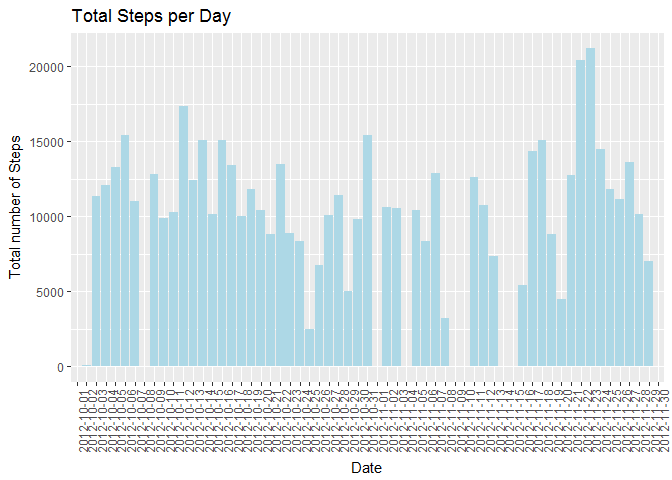
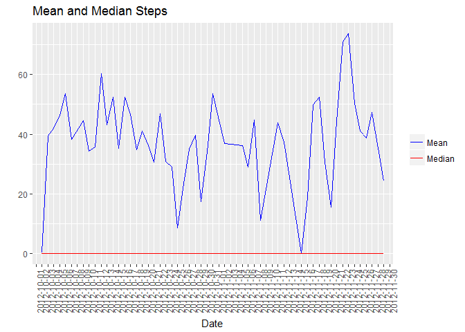
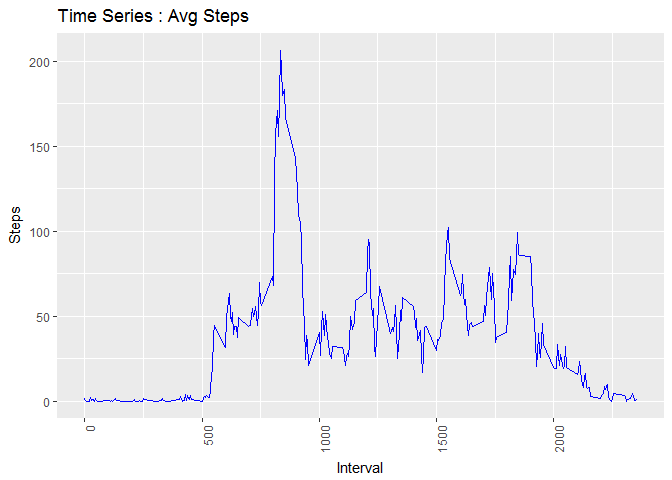
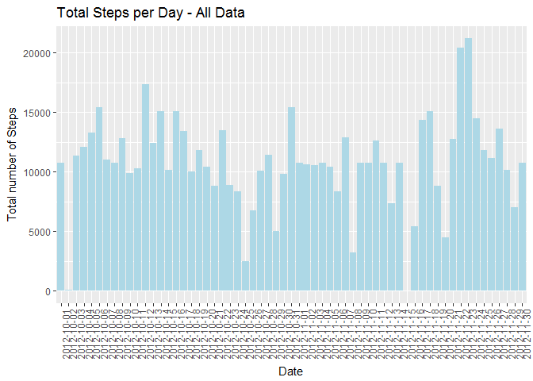
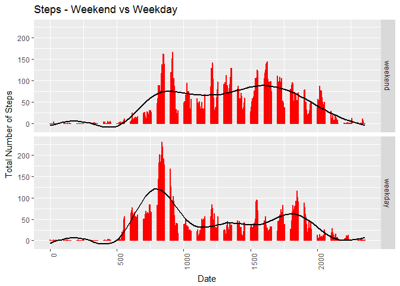

Quantified Self
===============

Monitoring the number of steps for an individual in the months of October and November, 2012
--------------------------------------------------------------------------------------------

This document will delve into the activity.csv dataset and will cover;

1.  Reading in the data
2.  Histogram of the total number of steps taken each day
3.  Mean and median number of steps taken each day
4.  Time series plot of the average number of steps taken  
5.  The 5-minute interval that, on average, contains the maximum number
    of steps
6.  Code to describe and show a strategy for imputing missing data
7.  Histogram of the total number of steps taken each day after missing
    values are imputed
8.  Panel plot comparing the average number of steps taken per 5 minute
    interval across weekdays and weekends

I will address each one by one.

### 1. Reading in the Data

    setwd("C:/Users/eo6405/Desktop/Misc - R/Coursera/Reproducible Research/Assignment 1")

    library(readr)
    activity <- read.csv("repdata%2Fdata%2Factivity/activity.csv")
    summary(activity)

    ##      steps                date          interval     
    ##  Min.   :  0.00   2012-10-01:  288   Min.   :   0.0  
    ##  1st Qu.:  0.00   2012-10-02:  288   1st Qu.: 588.8  
    ##  Median :  0.00   2012-10-03:  288   Median :1177.5  
    ##  Mean   : 37.38   2012-10-04:  288   Mean   :1177.5  
    ##  3rd Qu.: 12.00   2012-10-05:  288   3rd Qu.:1766.2  
    ##  Max.   :806.00   2012-10-06:  288   Max.   :2355.0  
    ##  NA's   :2304     (Other)   :15840

### 2. Histogram of the total number of steps taken each day

    library(ggplot2)

    ggplot(activity, aes(date, steps, group = 1)) + 
            stat_summary(geom = "bar", fun.y = "sum", fill = "lightblue") + 
            labs(x = "Date", y = "Total number of Steps", title = "Total Steps per Day") +
            theme(axis.text.x = element_text(angle = 90, hjust = 1))

    ## Warning: Removed 2304 rows containing non-finite values (stat_summary).

### 3. Mean and Median Steps per Day

    library(dplyr)

    ## 
    ## Attaching package: 'dplyr'

    ## The following objects are masked from 'package:stats':
    ## 
    ##     filter, lag

    ## The following objects are masked from 'package:base':
    ## 
    ##     intersect, setdiff, setequal, union

    activity %>% 
            group_by(date) %>%
            summarise(median(steps), mean(steps)) -> activity_by_day

    names(activity_by_day) <- c("Date", "Median", "Mean")

    activity_by_day

    ## # A tibble: 61 x 3
    ##          Date Median     Mean
    ##        <fctr>  <dbl>    <dbl>
    ##  1 2012-10-01     NA       NA
    ##  2 2012-10-02      0  0.43750
    ##  3 2012-10-03      0 39.41667
    ##  4 2012-10-04      0 42.06944
    ##  5 2012-10-05      0 46.15972
    ##  6 2012-10-06      0 53.54167
    ##  7 2012-10-07      0 38.24653
    ##  8 2012-10-08     NA       NA
    ##  9 2012-10-09      0 44.48264
    ## 10 2012-10-10      0 34.37500
    ## # ... with 51 more rows

Now plotting this...

    ggplot(activity, aes(date, steps, group = 1)) +
            stat_summary(aes(date, steps, color = "Mean"), geom = 'line', fun.y = "mean") +
            stat_summary(aes(date, steps, color = "Median"), geom = 'line', fun.y = "median") +
            theme(axis.text.x = element_text(angle = 90, hjust = 1)) +
            labs(x = "Date", y = "", title = "Mean and Median Steps") +
            scale_color_manual(name = "", values = c(Mean = "blue", Median = "red"))

    ## Warning: Removed 2304 rows containing non-finite values (stat_summary).

    ## Warning: Removed 2304 rows containing non-finite values (stat_summary).

Note that the median for each day appears to be 0.

### 4. Timeseries plot of average number of steps taken

    ggplot(activity, aes(interval, steps, group = 1)) +
            stat_summary(aes(interval, steps), geom = 'line', fun.y = "mean", color = "blue") +
            theme(axis.text.x = element_text(angle = 90, hjust = 1)) +
            labs(x = "Interval", y = "Steps", title = "Time Series : Avg Steps")

    ## Warning: Removed 2304 rows containing non-finite values (stat_summary).

### 5. 5 Minute interval that contains largest number of Steps

    activity_complete <- activity[complete.cases(activity),]

    activity_complete %>%
            group_by(interval) %>%
            summarise(Avg = mean(steps)) %>%
            arrange(desc(Avg)) -> steps_by_interval

    head(steps_by_interval)

    ## # A tibble: 6 x 2
    ##   interval      Avg
    ##      <int>    <dbl>
    ## 1      835 206.1698
    ## 2      840 195.9245
    ## 3      850 183.3962
    ## 4      845 179.5660
    ## 5      830 177.3019
    ## 6      820 171.1509

Interval 835 has the highest steps on average.

### 6. Strategy for imputing data

Methodology in imputing missing data is that, for that specific
interval, take the interval average. I create an 'Impute Mean' function
which I then apply, by level in Interval, to Steps. This has been saved
in 'activity\_imputed.'

    impute.mean <- function(x) replace(x, is.na(x), mean(x, na.rm = TRUE))
    activity %>%
            group_by(interval) %>%
            mutate(steps = impute.mean(steps)) -> activity_imputed

### 7. Histogram of total number of steps taken each day, with imputations.

This will be the same plot as in 2.

    ggplot(activity_imputed, aes(date, steps, group = 1)) + 
            stat_summary(geom = "bar", fun.y = "sum", fill = "lightblue") + 
            labs(x = "Date", y = "Total number of Steps", title = "Total Steps per Day - All Data") +
            theme(axis.text.x = element_text(angle = 90, hjust = 1))

### 8. Panel plot comparing the average number of steps taken per 5 minute interval across weekdays and weekends

To do this, I;

1.  Create a variable which pulls the day of the week out
2.  Create a vector which names all 'weekdays'
3.  Create a factor where, if the weekday falls within 'weekdays', it is
    named a 'weekday.' If not, it is a 'weekend.'
4.  Plot on two separate axes

<!-- -->

    activity_imputed$day <- weekdays(as.Date(activity_imputed$date))

    weekday <- c('Monday', 'Tuesday', 'Wednesday', 'Thursday', 'Friday')

    activity_imputed$weekday <- factor((activity_imputed$day) %in% weekday, 
                       levels=c(FALSE, TRUE), labels=c('weekend', 'weekday'))

    ggplot(activity_imputed, aes(interval, steps)) +
            stat_summary(geom = "bar", fun.y = "mean", color = "red") +
            facet_grid(weekday~.) +
            labs(x = "Date", y = "Total Number of Steps", title = "Steps - Weekend vs Weekday") +
            geom_smooth(se = FALSE, size = 1, color = "black") +
            theme(axis.text.x = element_text(angle = 90, hjust = 1))

    ## `geom_smooth()` using method = 'gam'

This concludes my assignment.
